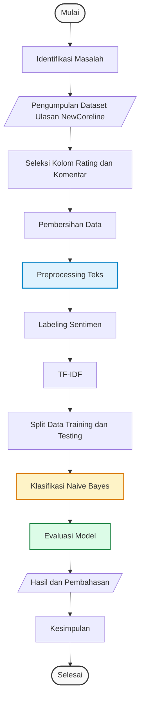

# 📊 Flowchart Analisis Sentimen Ulasan NewCoreline (Naive Bayes)

Dokumen ini berisi diagram alir (flowchart) serta penjelasan lengkap mengenai tahapan penelitian/proses analisis sentimen ulasan platform **NewCoreline** menggunakan algoritma **Naive Bayes**.

---

## 📐 Flowchart Proses (Mermaid.js)

Berikut adalah visualisasi alur kerja analisis sentimen dari awal hingga akhir:

---

## 📝 Penjelasan Rinci Setiap Tahapan

### 1. Identifikasi Masalah
*   **Tujuan**: Merumuskan masalah penelitian, yaitu bagaimana tingkat kepuasan pengguna terhadap platform NewCoreline dan bagaimana mengklasifikasikan ulasan pengguna secara otomatis ke dalam kategori sentimen tertentu.

### 2. Pengumpulan Dataset Ulasan NewCoreline
*   **Sumber Data**: Data ulasan diambil dari database ulasan NewCoreline melalui endpoint API `GET /api/coreline/courses/{id}/reviews` atau langsung dari tabel ulasan pengguna di database PostgreSQL/Supabase.
*   **Format**: Data mentah biasanya dikumpulkan dalam format CSV, JSON, atau tabel SQL.

### 3. Seleksi Kolom Rating dan Komentar
*   **Proses**: Menyaring data mentah dan hanya mengambil kolom/atribut yang relevan untuk analisis sentimen, yaitu:
    *   `Rating` (skor bintang 1-5).
    *   `Komentar / Ulasan` (teks tanggapan pengguna).

### 4. Pembersihan Data (Data Cleaning)
*   **Proses**: 
    *   Menghapus data kosong (*null value*) pada kolom komentar.
    *   Menghapus data ulasan duplikat untuk menghindari bias pada pelatihan model.
    *   Menyortir ulasan yang tidak relevan (misal: hanya berisi spasi atau karakter acak).

### 5. Preprocessing Teks (Pembersihan Teks NLP)
Tahap krusial untuk membersihkan teks sebelum diproses oleh algoritma machine learning:
1.  **Case Folding**: Mengubah seluruh huruf dalam teks ulasan menjadi huruf kecil (*lowercase*) agar konsisten.
2.  **Cleaning / Noise Removal**: Menghapus karakter khusus seperti angka, tanda baca, tautan URL, hashtag, emoji, dan spasi berlebih.
3.  **Tokenization**: Memotong kalimat ulasan menjadi kata-kata tunggal (*token*).
4.  **Stopwords Removal**: Menghapus kata-kata umum bahasa Indonesia yang tidak memiliki makna sentimen kuat (contoh: *dan, yang, di, ke, dari, adalah*).
5.  **Stemming**: Mengubah kata berimbuhan menjadi kata dasarnya menggunakan library NLP bahasa Indonesia (seperti Sastrawi) (contoh: *pembelajaran* $\rightarrow$ *ajar*, *menyenangkan* $\rightarrow$ *senang*).

### 6. Labeling Sentimen (Pemberian Label)
*   **Proses**: Menentukan kelas sentimen untuk setiap baris ulasan. 
*   **Pendekatan**:
    *   **Berbasis Rating**: 
        *   Rating 4 - 5 $\rightarrow$ **Sentimen Positif**
        *   Rating 3 $\rightarrow$ **Sentimen Netral**
        *   Rating 1 - 2 $\rightarrow$ **Sentimen Negatif**
    *   **Manual/Lexicon-based**: Menentukan sentimen berdasarkan keberadaan kamus kata positif dan negatif.

### 7. TF-IDF (Term Frequency - Inverse Document Frequency)
*   **Proses**: Mengubah data teks ulasan yang telah dibersihkan menjadi bentuk vektor angka.
*   **Formula**:
    *   *Term Frequency (TF)*: Seberapa sering sebuah kata muncul dalam ulasan tersebut.
    *   *Inverse Document Frequency (IDF)*: Seberapa penting kata tersebut di seluruh dataset ulasan.
    *   Kata yang unik dan membawa nilai sentimen kuat akan mendapatkan bobot TF-IDF yang lebih tinggi.

### 8. Split Data Training dan Testing
*   **Proses**: Membagi dataset berlabel secara acak menjadi dua bagian:
    *   **Data Training (latih)**: Umumnya **80%** dari total data, digunakan untuk melatih algoritma Naive Bayes agar mengenali pola sentimen.
    *   **Data Testing (uji)**: Umumnya **20%** dari total data, digunakan untuk menguji performa prediksi model.

### 9. Klasifikasi Naive Bayes
*   **Proses**: Menerapkan algoritma klasifikasi probabilitas berbasis Teorema Bayes.
*   **Penerapan**: Menghitung probabilitas suatu ulasan masuk ke kelas positif, negatif, atau netral berdasarkan bobot kata-kata yang menyusunnya. Model yang umum digunakan untuk klasifikasi teks adalah **Multinomial Naive Bayes**.

### 10. Evaluasi Model
*   **Proses**: Mengukur akurasi prediksi model terhadap data testing dengan membandingkan label hasil prediksi model dengan label asli (*ground truth*).
*   **Metrik Evaluasi**:
    *   **Accuracy**: Persentase tebakan sentimen yang benar dari keseluruhan data uji.
    *   **Precision**: Ketepatan prediksi model pada kelas tertentu.
    *   **Recall**: Kemampuan model dalam menemukan kembali informasi sentimen yang sebenarnya.
    *   **F1-Score**: Rata-rata harmonis dari precision dan recall.
    *   **Confusion Matrix**: Tabel visualisasi performa prediksi.

### 11. Hasil dan Pembahasan
*   **Proses**: Menganalisis keluaran model, menampilkan visualisasi seperti Word Cloud (kata yang paling sering muncul pada ulasan positif/negatif), grafik distribusi sentimen, serta menganalisis kesalahan prediksi model (*error analysis*).

### 12. Kesimpulan
*   **Proses**: Merumuskan kesimpulan akhir dari hasil klasifikasi sentimen, misalnya apakah platform NewCoreline mendapatkan sentimen mayoritas positif dari siswa, serta memberikan rekomendasi fitur yang perlu diperbaiki berdasarkan ulasan bersentimen negatif.
