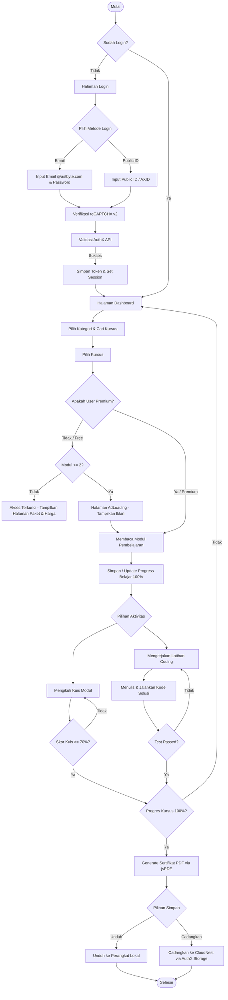
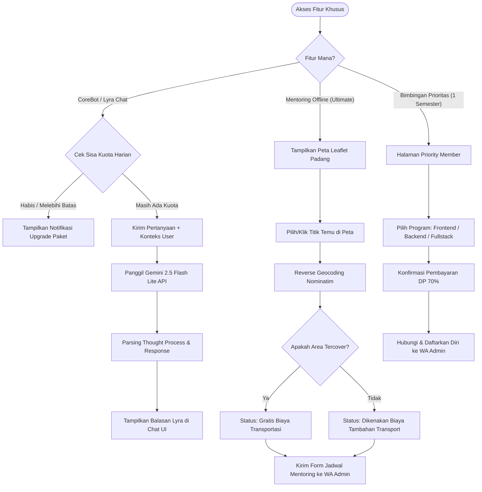

# 📘 Analisis Aktor & Use Case — NewCoreline by AstByte

Dokumen ini menjelaskan rancangan aktor (pengguna & sistem) beserta daftar lengkap *use case* pada platform **NewCoreline**, sebuah platform edukasi digital interaktif untuk mempelajari keterampilan teknologi dan pemrograman.

---

## 👥 Aktor (Actors)

Aktor didefinisikan sebagai entitas luar yang berinteraksi dengan sistem Coreline. Terdapat **Aktor Utama (Primary Actors)** yang menggunakan sistem secara langsung, dan **Aktor Pendukung (Supporting/Secondary Actors)** yang membantu sistem menjalankan fungsinya.

### 1. Aktor Utama (Primary Actors)

| Nama Aktor | Deskripsi & Batasan Akses |
| :--- | :--- |
| **Pengguna Gratis (Free Member)** | Pengguna terdaftar yang belum berlangganan paket premium. memiliki akses terbatas:<br>• Login via email/password atau Public ID (AXID) melalui AuthX.<br>• Akses terbatas hanya pada **2 modul pertama** di setiap kursus.<br>• Menghadapi halaman iklan (**AdLoadingPage**) saat berpindah materi modul gratis.<br>• Konsultasi dengan **CoreBot AI (Lyra)** dengan batas kuota sangat ketat (**5 pertanyaan per hari**).<br>• Mengakses halaman tutorial dasar, promo, dan paket harga. |
| **Pengguna Premium** | Pengguna yang berlangganan salah satu paket premium (**Pro, Plus, Ultra, atau Ultimate**).<br>• Bebas dari iklan/halaman loading paksa.<br>• Akses 100% ke seluruh modul pembelajaran (**15+ kursus, 200+ modul**).<br>• Mengikuti kuis interaktif dan latihan coding praktis di setiap modul.<br>• Pelacakan progress pembelajaran secara real-time.<br>• Mendapatkan sertifikat digital (PDF via jsPDF) setelah menyelesaikan kursus 100%.<br>• Memberikan rating dan ulasan (review) untuk kursus.<br>• Kuota harian Chat AI (Lyra) yang lebih besar sesuai tier paket. |
| **Siswa Bimbingan Prioritas** | Pengguna yang mendaftar ke program bimbingan intensif 1 semester (6 bulan) untuk kelas Frontend Mastery, Backend & API, atau Fullstack Engineer.<br>• Mengakses kurikulum bootcamp industri khusus.<br>• Pembayaran cicilan dengan DP 70% di awal dan pelunasan 30% di bulan kedua.<br>• Akses grup mastermind eksklusif. |

#### 🏷️ Rincian Fitur Khusus Berdasarkan Tier Premium:
*   **Pro Member**: Penyimpanan cloud 5 GB.
*   **Plus Member**: Penyimpanan cloud 10 GB, Akses *Full Source Code Project*, Template Portofolio, Mentoring Chat 1:1 via WhatsApp.
*   **Ultra Member**: Penyimpanan cloud 20 GB, Live Mentoring (Video Call), Personal Code Review, Konsultasi Karir & Review CV, Prioritas Rekomendasi Kerja.
*   **Ultimate Member**: Penyimpanan cloud 50 GB, Mentoring Offline (Tatap Muka) 3x sebulan di lokasi yang disepakati (area tercover), On-Site Code Review & Debugging, Private Networking Event.

---

### 2. Aktor Pendukung (Supporting/Secondary Actors)

| Nama Aktor | Deskripsi Peran |
| :--- | :--- |
| **AstByte AuthX API** | Layanan eksternal (`https://authx.astbyte.com`) yang menangani verifikasi login, data profil pengguna, pencatatan transaksi pembayaran, dan sinkronisasi status langganan. |
| **Google reCAPTCHA v2** | Layanan pihak ketiga yang memverifikasi bahwa login dilakukan oleh manusia untuk mencegah serangan bot. |
| **Admin / Mentor Coreline** | Staf/praktisi manusia yang melayani mentoring chat 1:1, melakukan review kode secara personal, memimpin sesi video call, mengajar sesi mentoring offline (tatap muka), serta mengurus administrasi pendaftaran & cicilan Bimbingan Prioritas. |

---

## 🗺️ Matriks Relasi Aktor & Use Case

Tabel di bawah ini memetakan relasi antara aktor dengan *use case* yang dapat mereka jalankan di platform Coreline:

| ID | Nama Use Case | Pengguna Gratis | Pengguna Premium | Siswa Prioritas | AuthX API | reCAPTCHA | Admin/Mentor |
| :--- | :--- | :---: | :---: | :---: | :---: | :---: | :---: |
| **UC-01** | Login Pengguna | ✔ | ✔ | ✔ | ✔ (S) | ✔ (S) | |
| **UC-02** | Mengakses Katalog Kursus | ✔ | ✔ | ✔ | ✔ (S) | | |
| **UC-03** | Mempelajari Modul (Dasar) | ✔ | ✔ | ✔ | | | |
| **UC-04** | Mempelajari Modul (Premium) | | ✔ | ✔ | ✔ (S) | | |
| **UC-05** | Mengikuti Kuis Modul | | ✔ | ✔ | | | |
| **UC-06** | Latihan Coding Praktik | | ✔ | ✔ | | | |
| **UC-07** | Generate & Unduh Sertifikat | | ✔ | ✔ | | | |
| **UC-08** | Simpan Sertifikat ke CloudNest | | ✔ | ✔ | ✔ (S) | | |
| **UC-09** | Mengirim Rating & Ulasan Kursus | | ✔ | ✔ | ✔ (S) | | |
| **UC-10** | Berdiskusi dengan AI Chatbot (Lyra) | ✔ | ✔ | ✔ | | | |
| **UC-11** | Membeli / Upgrade Paket Langganan | ✔ | ✔ | ✔ | ✔ (S) | | |
| **UC-12** | Mentoring Online & Code Review | | ✔ (Ultra/Ult) | ✔ | | | ✔ (S) |
| **UC-13** | Penjadwalan Mentoring Offline | | ✔ (Ultimate) | ✔ | | | ✔ (S) |
| **UC-14** | Pendaftaran Bimbingan Prioritas | ✔ | ✔ | ✔ | | | ✔ (S) |

*(S) = Supporting Actor (Aktor Pendukung)*

---

## 📊 Diagram Use Case & Flowchart

### 1. Use Case Diagram

Berikut adalah Use Case Diagram yang menggambarkan hubungan antara Aktor (Utama & Pendukung) dengan sistem NewCoreline:

```mermaid
leftToRightDirection

actor "Pengguna Gratis" as FreeUser
actor "Pengguna Premium\n(Pro/Plus/Ultra/Ultimate)" as PremiumUser
actor "Siswa Bimbingan Prioritas" as PriorityStudent

rectangle "NewCoreline Platform" {
  usecase "UC-01: Login Pengguna" as UC01
  usecase "UC-02: Mengakses Katalog Kursus" as UC02
  usecase "UC-03: Mempelajari Modul (Dasar)" as UC03
  usecase "UC-04: Mempelajari Modul (Premium)" as UC04
  usecase "UC-05: Mengikuti Kuis Modul" as UC05
  usecase "UC-06: Latihan Coding Praktik" as UC06
  usecase "UC-07: Generate & Unduh Sertifikat" as UC07
  usecase "UC-08: Simpan Sertifikat ke CloudNest" as UC08
  usecase "UC-09: Mengirim Rating & Ulasan Kursus" as UC09
  usecase "UC-10: Berdiskusi dengan AI Chatbot (Lyra)" as UC10
  usecase "UC-11: Membeli / Upgrade Paket Langganan" as UC11
  usecase "UC-12: Mentoring Online & Code Review" as UC12
  usecase "UC-13: Penjadwalan Mentoring Offline" as UC13
  usecase "UC-14: Pendaftaran Bimbingan Prioritas" as UC14
}

actor "AstByte AuthX API" as AuthX
actor "Google reCAPTCHA v2" as Recaptcha
actor "Admin / Mentor" as Admin

%% Hubungan Aktor Utama ke Use Case
FreeUser --> UC01
FreeUser --> UC02
FreeUser --> UC03
FreeUser --> UC10
FreeUser --> UC11
FreeUser --> UC14

PremiumUser --> UC01
PremiumUser --> UC02
PremiumUser --> UC03
PremiumUser --> UC04
PremiumUser --> UC05
PremiumUser --> UC06
PremiumUser --> UC07
PremiumUser --> UC08
PremiumUser --> UC09
PremiumUser --> UC10
PremiumUser --> UC11
PremiumUser --> UC12
PremiumUser --> UC13

PriorityStudent --> UC01
PriorityStudent --> UC02
PriorityStudent --> UC03
PriorityStudent --> UC04
PriorityStudent --> UC05
PriorityStudent --> UC06
PriorityStudent --> UC07
PriorityStudent --> UC08
PriorityStudent --> UC09
PriorityStudent --> UC10
PriorityStudent --> UC11
PriorityStudent --> UC12
PriorityStudent --> UC13
PriorityStudent --> UC14

%% Hubungan Use Case ke Aktor Pendukung
UC01 --> AuthX
UC01 --> Recaptcha
UC02 --> AuthX
UC04 --> AuthX
UC08 --> AuthX
UC09 --> AuthX
UC11 --> AuthX

UC12 --> Admin
UC13 --> Admin
UC14 --> Admin
```

---

### 2. Flowchart Alur Belajar & Pengambilan Sertifikat

Flowchart ini menggambarkan proses pengguna dari Login, mempelajari materi, menyelesaikan kuis/latihan, hingga mencadangkan/mengunduh sertifikat kelulusan:



---

### 3. Flowchart Fitur Khusus Premium (Lyra AI Chat & Offline Mentoring)

Flowchart ini menggambarkan proses interaksi dengan AI Chatbot (Lyra) dan pemesanan Mentoring Offline (tatap muka) menggunakan peta interaktif Leaflet:



---

## 📝 Deskripsi Detail Use Case (Use Case Specification)

Berikut adalah spesifikasi detail untuk masing-masing *use case* utama:

### UC-01: Login Pengguna
*   **Aktor Utama**: Pengguna Gratis, Pengguna Premium, Siswa Prioritas
*   **Aktor Pendukung**: AstByte AuthX API, Google reCAPTCHA
*   **Deskripsi**: Pengguna masuk ke akun mereka agar dapat mengakses dashboard pembelajaran.
*   **Alur Utama**:
    1. Pengguna membuka halaman Login.
    2. Pengguna memilih metode login: **Email** (`username@astbyte.com` + password) atau **Public ID** (AXID).
    3. Pengguna menyelesaikan tantangan Google reCAPTCHA.
    4. Pengguna menekan tombol "Masuk ke Dashboard".
    5. Sistem mengirimkan data kredensial dan token reCAPTCHA ke *AstByte AuthX API* untuk verifikasi.
    6. API memvalidasi data dan mengembalikan JWT Token.
    7. Sistem menyimpan token di `localStorage` (`astbyte_token`) dan mengarahkan pengguna ke halaman Dashboard.

---

### UC-02: Mengakses Katalog Kursus
*   **Aktor Utama**: Pengguna Gratis, Pengguna Premium, Siswa Prioritas
*   **Aktor Pendukung**: AstByte AuthX API
*   **Deskripsi**: Pengguna menjelajahi kelas-kelas coding dan non-coding yang tersedia di platform.
*   **Alur Utama**:
    1. Pengguna berada di halaman Dashboard.
    2. Sistem mengambil katalog kursus dari *AuthX API* (`GET /api/coreline/courses`).
    3. Sistem menampilkan daftar kursus berdasarkan kategori (Web Dev, Framework, Mobile, Backend, DevOps, Data Science, Language & Soft Skill).
    4. Pengguna dapat memfilter kursus berdasarkan tab kategori atau mencari dengan mengetik kata kunci pada kotak pencarian.

---

### UC-03: Mempelajari Modul Pembelajaran
*   **Aktor Utama**: Pengguna Gratis (terbatas), Pengguna Premium (penuh)
*   **Deskripsi**: Pengguna membaca materi teori yang disajikan dalam format interaktif Markdown.
*   **Alur Utama**:
    1. Pengguna memilih salah satu kursus di Dashboard.
    2. Sistem menampilkan daftar modul (15 - 30 modul per kursus).
    3. Pengguna memilih modul yang ingin dibaca.
    4. **[Alternatif - Pengguna Gratis]**: Jika modul yang dipilih memiliki urutan $> 2$, akses dikunci. Jika memilih modul 1 atau 2, pengguna diarahkan ke halaman iklan (**AdLoadingPage**) selama beberapa detik sebelum materi ditampilkan.
    5. **[Alternatif - Pengguna Premium]**: Pengguna langsung diarahkan ke halaman renderer materi (**MaterialPage** & **MaterialContent**) tanpa iklan.
    6. Pengguna membaca materi. Setelah selesai membaca, Pengguna Premium dapat menandai modul sebagai selesai secara manual (progress disimpan ke database via *AuthX API*).

---

### UC-04: Mengikuti Kuis Modul
*   **Aktor Utama**: Pengguna Premium, Siswa Prioritas
*   **Deskripsi**: Pengguna mengevaluasi pemahaman modul dengan menjawab kuis pilihan ganda.
*   **Alur Utama**:
    1. Pengguna Premium menyelesaikan pembacaan modul dan menekan tombol "Mulai Kuis".
    2. Sistem mengarahkan pengguna ke halaman **QuizPage**.
    3. Sistem memuat daftar soal pilihan ganda yang sesuai dengan modul tersebut.
    4. Pengguna memilih jawaban untuk setiap pertanyaan dan menekan "Selanjutnya".
    5. Setelah semua soal dijawab, pengguna menekan tombol "Kumpulkan".
    6. Sistem menghitung nilai akhir secara otomatis dan menampilkan hasil evaluasi (Persentase kelulusan, jumlah jawaban benar/salah).
    7. Pengguna memiliki opsi untuk mengulangi kuis jika nilainya belum memuaskan.

---

### UC-05: Latihan Coding Praktik
*   **Aktor Utama**: Pengguna Premium, Siswa Prioritas
*   **Deskripsi**: Pengguna menulis dan menguji kode pemrograman secara langsung di dalam browser menggunakan *editor code* interaktif.
*   **Alur Utama**:
    1. Pengguna memilih tombol "Latihan Praktik" pada materi modul.
    2. Sistem mengarahkan pengguna ke halaman **ExercisePage**.
    3. Sistem menampilkan instruksi tugas, contoh output yang diharapkan (*expected output*), dan editor teks berisi kode awal (*initial code*).
    4. Pengguna menuliskan kode solusi di dalam editor teks.
    5. Pengguna menekan tombol "RUN CODE".
    6. Sistem mengeksekusi kode (secara mock/sandboxed) dan mencocokkan keluarannya dengan *expected output*.
    7. Hasil eksekusi dan log pengujian ditampilkan pada panel konsol (*Output Console*). Jika benar, kuis ditandai selesai dan alert sukses akan muncul.

---

### UC-06: Generate & Unduh Sertifikat
*   **Aktor Utama**: Pengguna Premium, Siswa Prioritas
*   **Deskripsi**: Pengguna mengunduh sertifikat kelulusan resmi setelah menyelesaikan kursus dengan progres 100%.
*   **Alur Utama**:
    1. Pengguna menyelesaikan seluruh modul di suatu kursus (progres mencapai 100%).
    2. Tombol "Sertifikat" pada kursus tersebut di Dashboard menjadi aktif.
    3. Pengguna menekan tombol "Unduh Sertifikat".
    4. Sistem memicu fungsi JavaScript menggunakan pustaka **jsPDF** untuk menggambar template sertifikat secara dinamis (berisi Nama Pengguna, Nama Kursus, ID Sertifikat unik, Tanggal Kelulusan, dan Tanda Tangan CEO AstByte).
    5. Sertifikat diunduh secara otomatis ke penyimpanan lokal perangkat pengguna dalam format PDF.

---

### UC-07: Simpan Sertifikat ke CloudNest
*   **Aktor Utama**: Pengguna Premium, Siswa Prioritas
*   **Aktor Pendukung**: AstByte AuthX API (Storage Service)
*   **Deskripsi**: Pengguna mencadangkan berkas PDF sertifikat kelulusannya ke ruang penyimpanan awan CloudNest milik mereka.
*   **Alur Utama**:
    1. Pengguna menekan tombol dropdown pada modul sertifikat dan memilih "Cadangkan ke CloudNest".
    2. Sistem men-generate PDF sertifikat di memori.
    3. Sistem mengirimkan file PDF tersebut sebagai FormData ke endpoint storage (`POST /api/storage/files`) dengan menyertakan token autentikasi.
    4. Server AuthX menyimpan berkas tersebut ke penyimpanan CloudNest pengguna.
    5. Sistem menampilkan notifikasi sukses bahwa sertifikat telah aman tercadangkan.

---

### UC-08: Mengirim Rating & Ulasan Kursus
*   **Aktor Utama**: Pengguna Premium, Siswa Prioritas
*   **Aktor Pendukung**: AstByte AuthX API
*   **Deskripsi**: Pengguna memberikan umpan balik berupa skor bintang (1-5) dan testimoni tertulis untuk kursus yang dipelajarinya.
*   **Alur Utama**:
    1. Pengguna membuka detail kursus yang sedang dipelajari di Dashboard.
    2. Pengguna mengisi bagian rating (bintang 1-5) dan menuliskan ulasan singkat di formulir review yang disediakan.
    3. Pengguna menekan tombol "Kirim Rating".
    4. Sistem mengirimkan data rating ke server API (`POST /api/coreline/courses/{id}/rate`).
    5. Sistem memperbarui tampilan rating kursus secara real-time.

---

### UC-09: Berdiskusi dengan AI Chatbot (Lyra)
*   **Aktor Utama**: Pengguna Gratis (kuota harian 5), Pengguna Premium (kuota sesuai tier)
*   **Deskripsi**: Pengguna mengajukan pertanyaan seputar programming, penjelasan error, atau navigasi platform ke asisten cerdas berbasis Gemini.
*   **Alur Utama**:
    1. Pengguna membuka panel Chat CoreBot di Dashboard atau masuk ke halaman dedicated chat di `/lyra` (**LyraChatPage**).
    2. Sistem mengecek sisa kuota harian pengguna berdasarkan tipe akun.
    3. Pengguna mengetik pertanyaan pada kotak input dan menekan tombol kirim.
    4. Sistem menggabungkan teks pertanyaan dengan prompt sistem (berisi identitas pengguna, tipe paket, progress belajar, dan konteks aplikasi).
    5. Sistem memanggil API Google Generative AI (Gemini 2.5 Flash Lite) untuk mendapatkan jawaban.
    6. Jawaban yang diterima diparsing untuk memisahkan proses penalaran internal (*thought process*) dan teks respons final.
    7. Teks respons diformat menggunakan parser Markdown dan ditampilkan ke layar pengguna.

---

### UC-10: Membeli / Upgrade Paket Langganan
*   **Aktor Utama**: Pengguna Gratis, Pengguna Premium
*   **Aktor Pendukung**: AstByte AuthX API, Admin Coreline (Konfirmasi manual)
*   **Deskripsi**: Pengguna meningkatkan tier akun mereka (Pro / Plus / Ultra / Ultimate) untuk membuka berbagai fitur premium.
*   **Alur Utama**:
    1. Pengguna membuka halaman Paket & Harga (**Pricing**).
    2. Pengguna memilih siklus tagihan: Bulanan atau Tahunan (hemat extra 2 bulan).
    3. Pengguna menekan tombol "Pilih Paket" atau "Upgrade ke [Tier Baru]".
    4. Sistem mengarahkan pengguna ke halaman pembayaran manual QRIS (**Pay**).
    5. Pengguna memindai kode QRIS dan melakukan transfer nominal sesuai instruksi.
    6. Pengguna menekan tombol konfirmasi pembayaran yang akan mengarahkan mereka untuk mengirimkan bukti transfer ke WhatsApp Admin Coreline.
    7. Setelah verifikasi oleh Admin, status langganan pengguna diubah di database *AuthX API*.

---

### UC-11: Penjadwalan Mentoring Offline (Tatap Muka)
*   **Aktor Utama**: Pengguna Premium (Ultimate)
*   **Aktor Pendukung**: Leaflet Map API, Admin/Mentor Coreline (via WA)
*   **Deskripsi**: Pengguna paket Ultimate menentukan titik temu mentoring tatap muka langsung di lapangan dengan mentor.
*   **Alur Utama**:
    1. Pengguna Ultimate mengakses halaman Mentoring Offline (**OfflineMentoringPage**).
    2. Sistem menampilkan peta interaktif terintegrasi (**Leaflet Map**) dengan fokus awal di Kota Padang (lokasi pusat PT Astral Byte Technology).
    3. Pengguna mengklik lokasi di peta atau memasukkan koordinat alamat pada bilah pencarian.
    4. Sistem memanggil API Nominatim OpenStreetMap untuk reverse-geocoding koordinat menjadi alamat teks.
    5. Sistem memeriksa ketersediaan wilayah berdasarkan algoritma cakupan area gratis (Indarung, Lubuk Kilangan, Kuranji, Pauh, Gadut, Bandar Buat, Lubuk Begalung, dll).
    6. **[Alternatif - Area Tercover]**: Sistem menampilkan status "Area Terjangkau (Gratis Transportasi)".
    7. **[Alternatif - Luar Area]**: Sistem menampilkan status "Dikenakan Biaya Tambahan Transport".
    8. Pengguna menekan tombol "Hubungi Admin via WA" untuk mengirim detail koordinat/alamat dan menyepakati waktu mentoring tatap muka.

---

### UC-12: Pendaftaran Bimbingan Prioritas (Bootcamp)
*   **Aktor Utama**: Siswa Bimbingan Prioritas / Pengguna Tertarik
*   **Aktor Pendukung**: Admin Coreline (via WA)
*   **Deskripsi**: Pengguna mendaftar ke program bimbingan intensif 1 semester dengan jaminan siap kerja.
*   **Alur Utama**:
    1. Pengguna mengakses halaman Bimbingan Prioritas (**PriorityMemberPage**).
    2. Pengguna melihat detail 3 jalur program: **Frontend Mastery**, **Backend & API**, dan **Fullstack Engineer**.
    3. Pengguna membaca skema pembayaran cicilan (DP 70% di awal dan 30% di bulan kedua).
    4. Pengguna memilih program yang diinginkan dan menekan tombol "Daftar via WhatsApp".
    5. Sistem membuka tautan WhatsApp ke nomor resmi admin Coreline dengan pesan berisi program pilihan dan permohonan tata cara cicilan/pembayaran DP.
    6. Admin Coreline memproses pendaftaran dan mencatat siswa ke database kelas prioritas.
